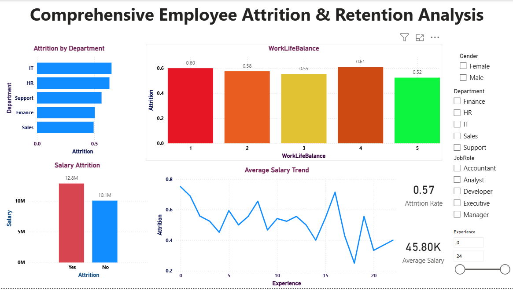

Employee Attrition Analysis

Overview

Employee attrition is a critical workforce challenge that impacts productivity, costs, and organizational stability. This project performs an end-to-end analysis of employee attrition data to identify key drivers of turnover and provide actionable retention insights.

The analysis integrates data cleaning, SQL-based exploration, Python analytics, and interactive dashboarding to deliver business-ready insights.

Objectives

* Analyze attrition trends across departments and roles

* Identify factors influencing employee turnover

* Evaluate the impact of salary, experience, satisfaction, and work-life balance

* Build an interactive dashboard to support HR decision-making

Tools & Technologies

* Excel — data preparation and cleaning

* MySQL — data storage and SQL analysis

* Python (Pandas, Matplotlib, Seaborn) — data analysis & visualization

* Power BI — interactive dashboard & insights

* GitHub — version control & project portfolio

Dataset Description

The dataset contains 500 employee records with the following attributes:

* Employee ID

* Age

* Gender

* Department

* Job Role

* Salary

* Years of Experience

* Job Satisfaction (1–5)

* Work-Life Balance (1–5)

* Attrition Status (Yes/No)

Methodology

1. Data Cleaning & Preparation (Excel)

* Removed duplicates and inconsistencies

* Standardized column naming conventions

* Validated missing and incorrect values

2. SQL Analysis (MySQL)

Key queries performed:

* Attrition count and rate

* Department-wise attrition analysis

* Salary comparison by attrition status

* Experience and satisfaction impact analysis

3. Python Analysis

Using Pandas and visualization libraries:

* Attrition distribution analysis

* Salary vs attrition comparison

* Job satisfaction & work-life balance impact

* Experience trend analysis

* Generated charts and analytical outputs

4. Power BI Dashboard

Developed an interactive dashboard featuring:

* Attrition Rate KPI

* Department attrition comparison

* Salary impact visualization

* Experience vs attrition trends

* Work-life balance insights

* Interactive slicers (Department, Role, Gender)

Key Insights

* The overall attrition rate is **57%**, indicating retention challenges.

* IT and HR departments experience higher attrition levels.

* Employees with lower salaries are more likely to leave.

* Early-career employees show higher turnover rates.

* Work-life balance alone does not guarantee employee retention.

Business Recommendations

* Review compensation strategies to improve retention

* Strengthen engagement programs for early-career employees

* Focus retention initiatives in high-attrition departments

* Enhance job satisfaction and employee experience initiatives

Project Structure

Employee-Attrition-Analysis/

│

├── data/ Dataset files

├── sql/ SQL scripts

├── python/ Python analysis scripts

├── dashboard/ Power BI screenshots

├── outputs/ Generated charts & results

└── README.md

Author

Kaviya Arumaidurai

Data Analyst

Acknowledgment

This project was developed as part of a data analytics portfolio to demonstrate practical skills in data cleaning, analysis, visualization, and business insight generation.
